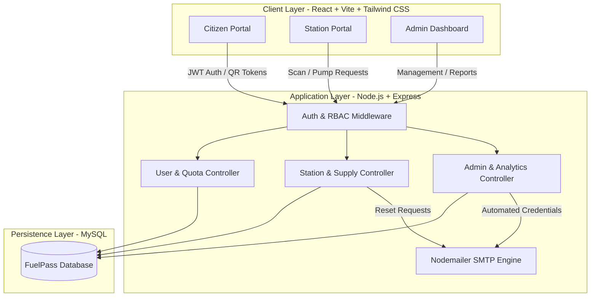

# ⛽ FuelPass - National Fuel Quota & Station Management System

<div align="center">


<p align="center">
  <strong>A modern, full-stack, QR-powered fuel quota allocation, station supply tracking, and national distribution management platform.</strong>
</p>

[Key Features](#-key-features) •
[System Architecture](#-system-architecture) •
[Portals & Workflows](#-portals--workflows) •
[Tech Stack](#-tech-stack) •
[Quick Start](#-quick-start) •
[API Documentation](#-api-endpoints) •
[License](#-license)

</div>

---

## 📖 Overview

The **National FuelPass Management System** is a robust web platform designed to streamline fuel distribution, eliminate long station queues, and provide complete transparency across fuel quotas, retail station inventories, and regulatory oversight.

Featuring a futuristic dark-neon design system with high-speed QR verification, the system supports three distinct operational tiers: **Vehicle Owners**, **Station Operators**, and **System Administrators**.

---

## ✨ Key Features

### 👤 1. Citizen & Vehicle Owner Portal
- **NIC-Based Registration & OTP Login**: Fast and secure onboarding with SMS/Email OTP authentication.
- **Multi-Vehicle Support**: Register and manage up to **3 vehicles** under a single national identity (NIC).
- **Dynamic Quota Allocation**: Weekly quota limits automatically assigned based on vehicle classification (Bikes, Cars, Three-Wheelers, Vans, Buses, Lorries).
- **Instant QR Fuel Pass**: High-resolution QR code encoding encrypted vehicle and quota tokens for quick scan-to-pump verification.
- **Quota Reservation & Carry-Forward**: Reserve unused fuel quota for future weeks with strict carry-forward caps.
- **Live Transaction History**: Real-time record of fuel pumped, remaining quota, dates, and dispensing stations.

### ⛽ 2. Fuel Station Operator Portal
- **Scan & Validate QR Pass**: Instant verification of customer fuel eligibility and remaining quotas.
- **Stock Management**: Live monitoring and automated deductions for **Petrol** and **Diesel** tanks.
- **Stock Replenishment Logging**: Record incoming bowser fuel deliveries with auto-generated reference numbers (e.g. `SUP-ST001-20260325-001`) backed by atomic database transactions.
- **First-Time Security Policy**: Automated credential delivery via HTML email with mandatory strong password creation on initial login.
- **Admin-Managed Password Recovery**: Submit password reset requests directly to administration with real-time status notifications.
- **Pagination & Auditing**: High-performance paginated transaction records and fuel update logs.

### 🛡️ 3. National Admin Management Portal
- **Executive Dashboard**: Real-time telemetry displaying total national petrol/diesel stock, active station count, and daily fuel issued.
- **7-Day Consumption Trends**: Interactive charts showing multi-fuel usage patterns and peak demand periods.
- **Station Management**: Provision new fuel stations with auto-generated IDs and instant automated credential dispatch via email.
- **Quota Rules Engine**: Configure weekly fuel limits and carry-forward thresholds across vehicle categories dynamically.
- **Approval Desk**: Review, approve, or reject station password reset requests with automated email notifications.
- **Monthly Auditing & Reports**: Generate and export comprehensive station distribution and quota utilization reports.

---

## 🏗️ System Architecture



---

## 🚀 Portals & Workflows

### 🔐 First-Time Station Onboarding Flow
1. **Admin Provisions Station**: Admin enters Station Name, Location, and Email in the Admin Portal.
2. **Automated Credentials Email**: System generates a 6-digit temporary PIN and delivers a styled credentials email to the station.
3. **Mandatory Password Reset**: Upon first login, the operator is prompted to set a permanent, secure password (requiring letters, numbers, and special characters).
4. **Dashboard Access**: After password creation, the station operator gains immediate access to scanning and dispensing tools.

---

## 💻 Tech Stack

| Domain | Technologies |
| :--- | :--- |
| **Frontend** | React 18, Vite, Tailwind CSS, Lucide Icons, Recharts |
| **Backend** | Node.js, Express.js, RESTful APIs |
| **Database** | MySQL 8.0+, Connection Pooling, ACID Transactions |
| **Authentication** | JSON Web Tokens (JWT), Role-Based Access Control (RBAC) |
| **Email Services** | Nodemailer (Gmail SMTP / Custom SMTP) |
| **QR Engine** | qrcode.react / html5-qrcode |

---

## 📁 Directory Structure

```text
fuelpass-management-system/
├── backend/
│   ├── config/             # Database connection & pooling configuration
│   ├── controllers/        # Auth, User, Station, and Admin controllers
│   ├── middleware/         # JWT verification & input validation
│   ├── models/             # MySQL data models and SQL query execution
│   ├── routes/             # Express API route declarations
│   ├── utils/              # Email templates and helper utilities
│   ├── migrate.js          # Automated database schema migration script
│   └── server.js           # Server entry point
├── frontend/
│   ├── src/
│   │   ├── components/     # Reusable UI components & modals
│   │   ├── pages/          # Admin, Station, and User portal pages
│   │   ├── routes/         # React Router navigation configuration
│   │   └── index.css       # Tailwind design tokens & dark theme styles
│   ├── index.html          # Application root HTML
│   └── vite.config.js      # Vite build configuration
├── database/
│   └── fuelpass.sql        # Initial database schema dump
└── README.md
```

---

## ⚡ Quick Start

### Prerequisites
- [Node.js](https://nodejs.org/) (v18.x or higher)
- [MySQL Server](https://www.mysql.com/) (v8.0 or higher)
- `npm` or `yarn`

### 1. Clone the Repository
```bash
git clone git@github.com:nirsanth23/fuelpass-management-system.git
cd fuelpass-management-system
```

### 2. Configure Backend Environment
Navigate to `backend/` and create a `.env` file:
```bash
cd backend
cp .env.example .env   # Or create .env manually
```

Configure your `.env` settings:
```env
PORT=5050
DB_HOST=localhost
DB_USER=root
DB_PASSWORD=your_mysql_password
DB_NAME=fuelpass
JWT_SECRET=your_jwt_secret_key_here
EMAIL_USER=your_email@gmail.com
EMAIL_PASS=your_gmail_app_password
```

### 3. Run Database Migrations
Execute the automated migration script to initialize all tables, columns, and seed data:
```bash
npm install
npm run migrate
```

### 4. Start the Backend Server
```bash
npm run dev
# Backend running at http://localhost:5050
```

### 5. Configure & Launch Frontend
In a new terminal window:
```bash
cd ../frontend
npm install
npm run dev
# Frontend running at http://localhost:5173
```

---

## 📡 API Endpoints

### Authentication & User
| Method | Endpoint | Description | Access |
| :--- | :--- | :--- | :--- |
| `POST` | `/api/auth/send-otp` | Request OTP for registration/login | Public |
| `POST` | `/api/auth/verify-otp` | Verify OTP and issue token | Public |
| `POST` | `/api/auth/register` | Register new user with NIC & vehicle | Public |
| `POST` | `/api/auth/station-login` | Fuel station operator authentication | Public |
| `POST` | `/api/auth/change-station-password` | Mandatory initial password update | Station |
| `GET` | `/api/auth/me` | Fetch active user profile & quota | Citizen |
| `POST` | `/api/auth/reserve-fuel` | Reserve fuel quota for upcoming week | Citizen |

### Fuel Station
| Method | Endpoint | Description | Access |
| :--- | :--- | :--- | :--- |
| `GET` | `/api/station/dashboard` | Station stats, stocks, and daily logs | Station |
| `POST` | `/api/station/supplies` | Record fuel supply delivery | Station |
| `GET` | `/api/station/profile` | Fetch station profile details | Station |
| `PUT` | `/api/station/profile` | Update station profile details | Station |

### Administration
| Method | Endpoint | Description | Access |
| :--- | :--- | :--- | :--- |
| `GET` | `/api/admin/summary` | Fetch global telemetry & stock totals | Admin |
| `GET` | `/api/admin/stations` | List all registered fuel stations | Admin |
| `POST` | `/api/admin/stations` | Provision new station & email credentials | Admin |
| `GET` | `/api/admin/quota-rules` | Fetch vehicle quota allocation rules | Admin |
| `PUT` | `/api/admin/quota-rules` | Update quota limits by vehicle category | Admin |
| `POST` | `/api/admin/send-station-password` | Approve reset & issue 6-digit PIN | Admin |
| `POST` | `/api/admin/reject-station-password` | Reject password reset request | Admin |

---

## 🛡️ Security Best Practices

- **Token-Based Authentication**: Secure stateless authentication using JSON Web Tokens (JWT).
- **Password Strength Policy**: Strict regex validation enforcing uppercase, lowercase, numeric, and special characters.
- **SQL Injection Prevention**: Parameterized queries across all database drivers.
- **Atomic Operations**: Database transactions for stock additions and dispensing to guarantee data consistency.

---

## 📄 License

This project is licensed under the **MIT License** - see the [LICENSE](LICENSE) file for details.

---

<div align="center">
  <sub>Developed by <a href="https://github.com/nirsanth23">Nirsanth</a> • Built with ❤️ for National Energy Management</sub>
</div>
